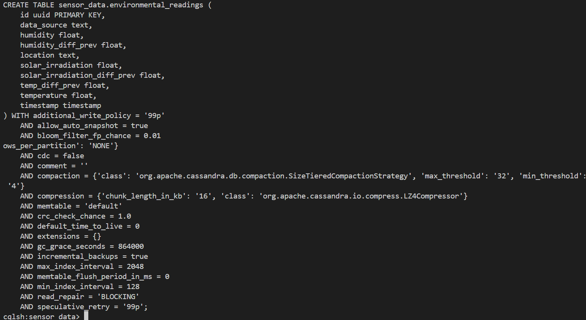
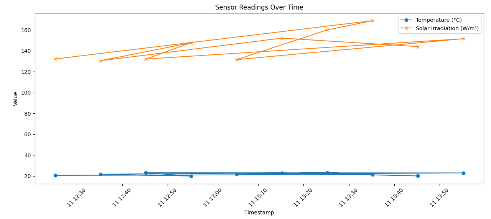

# Homework 4 - Distributed and Parallel Computing

##  Instructor:
Prof. Dr. Erekle Magradze

##  Student:
Jambuli Chkhikvadze

## What This Project Does

This homework sets up **Apache Cassandra** using **Docker**, creates a database to store environmental sensor data, and uses **Python** to insert and plot sample data.


## Setup Steps 

### 1. Clone the GitHub repo to the computer

```bash
git clone https://github.com/Jaba-Ch/DistrandParallelComputing
cd DistrandParallelComputing
```

### 2. Run Cassandra using Docker

Start the Cassandra container:
```bash
docker compose up -d
```

### 3. Create the Cassandra schema
Run these steps:

```bash
docker cp schema.cql cassandra:/schema.cql
docker exec -it cassandra cqlsh
```
Inside cqlsh, run:

```bash
SOURCE '/schema.cql';
```

### 4. Validate in CQL
Run inside cqlsh:

```bash
DESCRIBE KEYSPACES;
USE sensor_data;
DESCRIBE TABLE environmental_readings;
```

### 5. Insert Sample Data with Python


Install the Cassandra Python driver:

```bash
pip install cassandra-driver
```

Run the insert script:

```bash
python insert_data.py
```

It adds 10 fake sensor records to Cassandra.



### 6. Plot Temperature and Solar Irradiation
Install matplotlib:

```bash
pip install matplotlib
```

Then run:

```bash
python plot_data.py
```
This shows a graph of temperature and solar irradiation over time.


